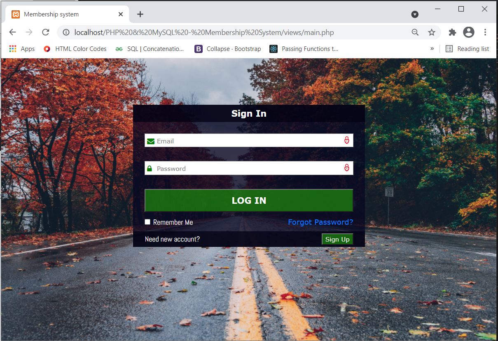
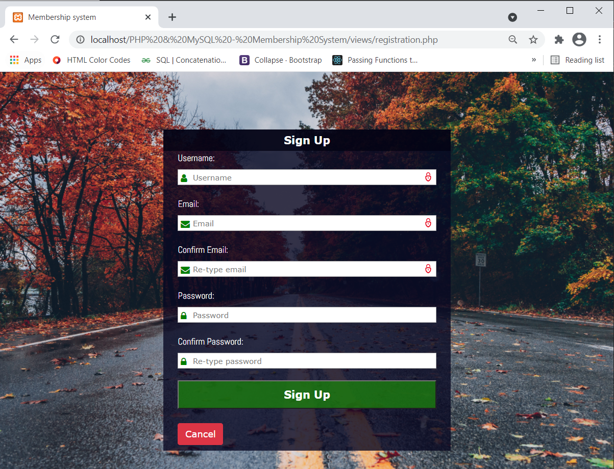

# PHP - Complete user registration system using PHP and MySQL database
A complete user registration system using PHP and MySQL database.

## Requirements
* phpMyAdmin v5.0.4
* XAMPP Control Panel v3.2.4

## General Info
  
By developing this interesting project I went through the complete process of creating a user registration system where users can create an account by providing username, email and password. If users that attempt to log in to the database provide the correct data, they'll be redirected to their own page with the personal data. That page is accessible only to logged-in users.  
When trying to register an account, you need to enter the hashed password for security reasons. You are required to re-enter your password and email as well. Your email and password go through a complete verification.  
The layout of home page is given by the following image:  



From the homepage, you can get to the registration or sign-up page by clicking on the sign up button.
When you click on this button, you'll be redirected to the registration page. The layout of the registration page is given below: 



## Configuration instructions

The first thing you'll need to do is set up your database. Create a database called userdb. In the registration database, add a table called users. The users table will take the following three fields.  

* username - varchar(15)
* email - varchar(30)
* password - varchar(20)

You can create this using a MySQL client like PHPMyAdmin. When you set up your database, you need to connect to it. To connect to the database, use the following simple code:
```bash
$link = mysqli_connect("localhost", "root", "");
mysqli_select_db($link, "userdb");  

if(!$link):
  if(!mysqli_select_db($link, "userdb")):
     exit("Database <userdb> does not exist!");
  else:
     exit("Can't connect to local MySQL server!");
  endif;
endif;
```
For creating the connection is used the function mysqli_connect that takes the host name, username and password for the account that has the right of access to the database at MySQL server.
<!--To do these actions you'll need a free software tool written in PHP - phpMyAdmin.-->

## 🙌 Contribution
I hope that this project will help you to unlock new ideas and improve your skills. Should you need any further information, please do not hesitate to [contact](mailto:agagula3@etf.unsa.ba) me.  
  
Best regards,  
Ajdin G.
